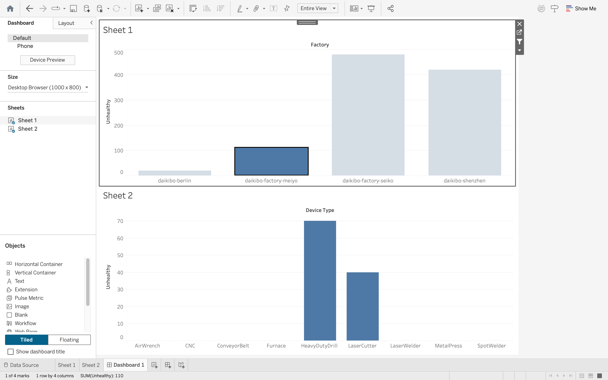

# Deloitte Data Analytics Virtual Internship

This project is based on the Deloitte Data Analytics Virtual Job Simulation on Forage, where I worked on real-world business data problems.

## Tasks Performed
- Data cleaning and preprocessing using Excel
- Data classification and analysis
- Identifying patterns and deriving business insights
- Creating interactive dashboards using Tableau

## Tools Used
- Microsoft Excel
- Tableau

## Key Outcomes
- Analyzed datasets to identify trends and anomalies
- Created visual dashboards to present insights clearly
- Developed understanding of data-driven decision making

## Files Included
- Excel datasets and analysis
- Tableau dashboard 
- Supporting documents

## About the Program
This simulation helped me understand how data analytics is used in real business scenarios, including problem-solving and decision-making.

---

This project reflects my interest in data analytics and applying analytical thinking to real-world problems.

### Screenshot
Here’s a preview of the dashboard I created using Tableau:

---

Created by: [Sanya Sharma](https://www.linkedin.com/in/sanya-sharma-74a7a3330/)
